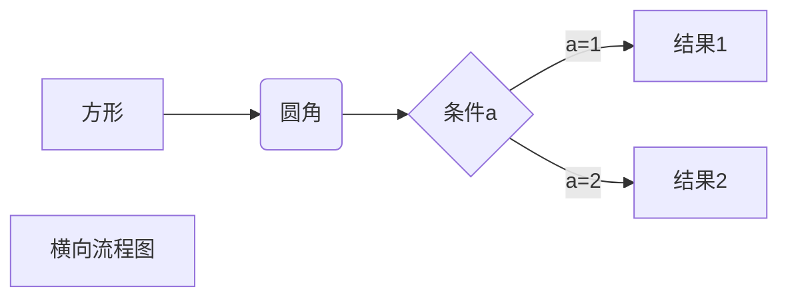
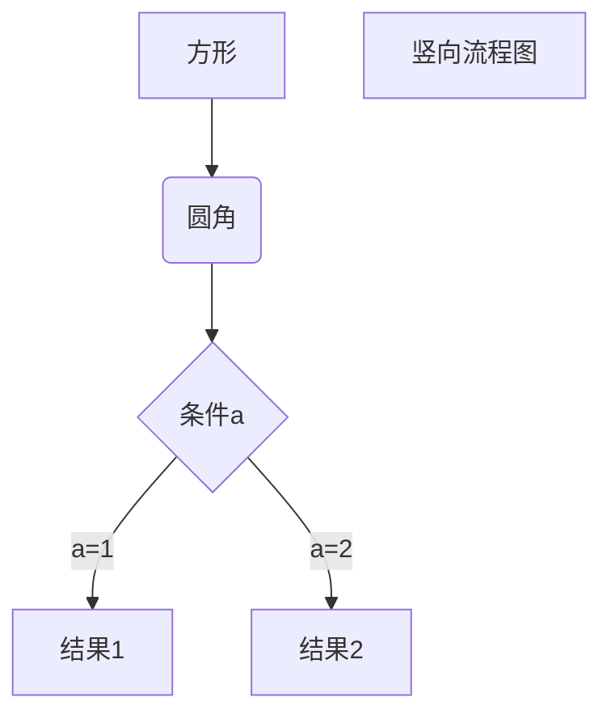
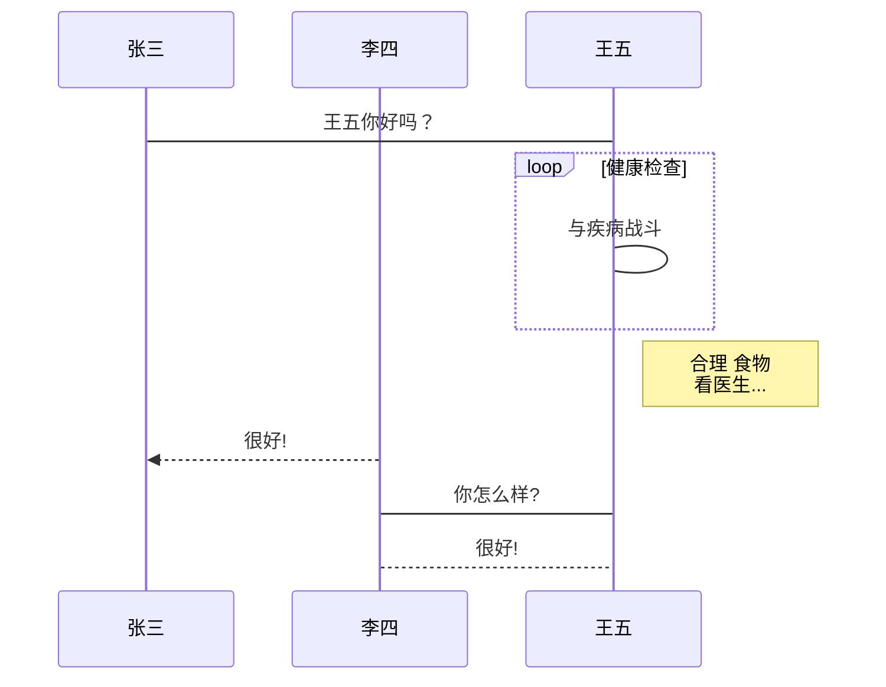
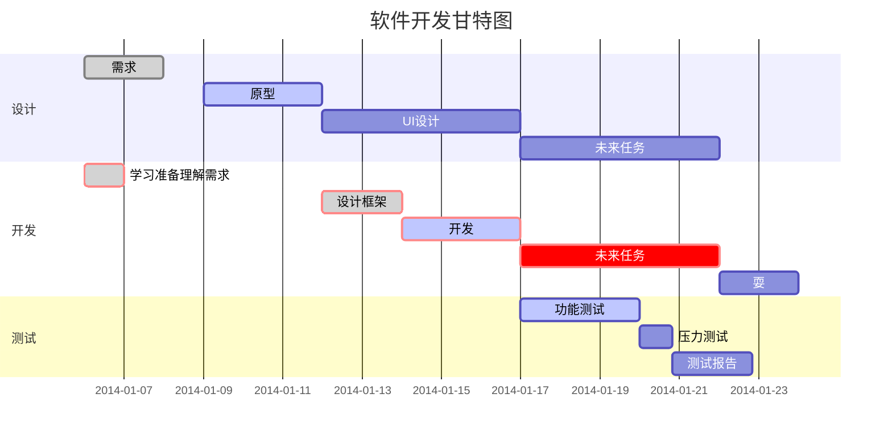

- 第三章：Basics

  - 2.1：计数器示例
  - 2.2：Widget简介
  - 2.3：状态管理
  - 2.4：路由管理
  - 2.5：包管理
  - 2.6：资源管理
  - 2.7：调试
  - 2.8：异常捕获与上报

- 第三章：Widgets

  - 3.1：文本、字体样式
  - 3.2：按钮
  - 3.3：图片和Icon
  - 3.4：单选框和复选框
  - 3.5：输入框和表单
  - 3.6：进度指示器

- 第四章：布局类组件

- ### UI Components

- - 4.1：布局类组件简介
  - 4.2：布局原理与约束（constraints）
  - 4.3：线性布局（Row、Column）
  - 4.4：弹性布局（Flex）
  - 4.5：流式布局（Wrap、Flow）
  - 4.6：层叠布局（Stack、Positioned）
  - 4.7：对齐与相对定位（Align）
  - 4.8：LayoutBuilder、AfterLayout

- 第五章：容器类组件

- ### Design & Animations

- - 5.1：填充（Padding）
  - 5.2：装饰容器（DecoratedBox）
  - 5.3：变换（Transform）
  - 5.4：Container容器
  - 5.5：剪裁（Clip）
  - 5.6：空间适配FittedBox
  - 5.7：页面骨架Scaffold

## 进阶篇

- 第六章：可滚动组件

- ### Forms & Gestures

- - 6.1：可滚动组件简介
  - 6.2：SingleChildScrollView
  - 6.3：ListView
  - 6.4：滚动监听及控制（ScrollController）
  - 6.5：AnimatedList
  - 6.6：GridView
  - 6.7：PageView与页面缓存
  - 6.8：可滚动组件子项缓存
  - 6.9：TabBarView
  - 6.10：CustomScrollView与Slivers
  - 6.11：自定义Sliver
  - 6.12：NestedScrollView

- 第七章：功能型组件

- ### Navigation & Routing

- - 7.1：导航返回拦截（WillPopScope）
  - 7.2：数据共享（InheritedWidget）
  - 7.3：跨组件状态共享（Provider）
  - 7.4：颜色和主题（Theme）
  - 7.5：ValueListenableBuilder
  - 7.6：异步UI更新（FutureBuilder、StreamBuilder）
  - 7.7：对话框详解

- 第八章访问设备

  - 8.1：原始指针事件处理
  - 8.2：手势识别
  - 8.3：Flutter事件机制
  - 8.4：手势原理与手势冲突
  - 8.5：全局事件总线
  - 8.6：通知(Notification)

- 第九章：动画

  - 9.1：Flutter动画简介
  - 9.2：动画结构
  - 9.3：自定义路由过渡动画
  - 9.4：Hero动画
  - 9.5：交织动画
  - 9.6：通用“动画切换”组件（AnimatedSwitcher）
  - 9.7：动画过渡组件

- 第十章：自定义组件

  - 10.1：自定义组件方法简介
  - 10.2：组合现有组件
  - 10.3：组合实例：TurnBox
  - 10.4：CustomPaint与Canvas
  - 10.5：自绘实例：圆形渐变进度条
  - 10.6：自绘组件：CustomCheckbox
  - 10.7：自绘组件：DoneWidget
  - 10.8：水印组件实例：文本绘制与离屏渲染

- 第十一章：文件操作与网络请求

  - 11.1：文件操作
  - 11.2：Http请求-HttpClient
  - 11.3：*Http请求封装
  - 11.5：WebSocket
  - 11.6：使用Socket API
  - 11.7：Json转Dart Model类

- 第十二章：包与插件 ...

- 第十三章：国际化

  - 13.1：让App支持多语言
  - 13.2：实现Localizations
  - 13.3：使用Intl包
  - 13.4：国际化常见问题

- 第十四章：Flutter核心原理

  - 14.1：Flutter UI框架（Framework）
  - 14.2：Element、BuildContext和RenderObject
  - 14.3：Flutter启动流程和渲染管线
  - 14.4：Flutter 布局（Layout）过程
  - 14.5：Flutter 绘制（一）绘制原理及Layer
  - 14.6：Flutter 绘制（二）组件树绘制流程
  - 14.7：Flutter 绘制（三）Layer实例
  - 14.8：Flutter 绘制（四）Compositing
  - 14.9：Flutter 图片加载与缓存
  - 14.10：Flutter 性能优化建议

## 实例篇

- 第十五章：一个完整的Flutter应用

  - 15.1：应用简介
  - 15.2：APP代码结构
  - 15.3：Model类定义
  - 15.4：全局变量及共享状态
  - 15.5：网络请求封装
  - 15.6：App入口及首页
  - 15.7：登录页
  - 15.8：多语言和多主题

- ### 先进的概念

- ### **Flutter Apps**

- - 

- 

设置Flutter

介绍小工具

Flutter 中常见的 Widget

无状态和有状态小部件 - 概念通过导航导航

处理用户输入。

用户界面

步函数

使用远程数据

使用第 3 方软件包

https://www.javatpoint.com/dart-programming

https://www.raywenderlich.com/22685966-dart-basics


import 'package:client_proj/page/activity/activity_info_page.dart';

ActivityInfoPage page = ActivityInfoPage(actInfo: _info);

​        Navigator.pushNamed(context, page.runtimeType.toString(),

​          arguments: page);

`hsh`

```
使用 <kbd>Ctrl</kbd>+<kbd>Alt</kbd>+<kbd>Del</kbd> 重启电脑
```

使用 <kbd>Ctrl</kbd>+<kbd>Alt</kbd>+<kbd>Del</kbd> 重启电脑

```
$$
\mathbf{V}_1 \times \mathbf{V}_2 =  \begin{vmatrix} 
\mathbf{i} & \mathbf{j} & \mathbf{k} \\
\frac{\partial X}{\partial u} &  \frac{\partial Y}{\partial u} & 0 \\
\frac{\partial X}{\partial v} &  \frac{\partial Y}{\partial v} & 0 \\
\end{vmatrix}
${$tep1}{\style{visibility:hidden}{(x+1)(x+1)}}
$$
```


$$
\mathbf{V}_1 \times \mathbf{V}_2 =  \begin{vmatrix} 
\mathbf{i} & \mathbf{j} & \mathbf{k} \\
\frac{\partial X}{\partial u} &  \frac{\partial Y}{\partial u} & 0 \\
\frac{\partial X}{\partial v} &  \frac{\partial Y}{\partial v} & 0 \\
\end{vmatrix}
${$tep1}{\style{visibility:hidden}{(x+1)(x+1)}}
$$

以下几个实例效果图如下：

**1、横向流程图源码格式：**

```
​```mermaid
graph LR
A[方形] -->B(圆角)
    B --> C{条件a}
    C -->|a=1| D[结果1]
    C -->|a=2| E[结果2]
    F[横向流程图]
​```
```

**2、竖向流程图源码格式：**

```
​```mermaid
graph TD
A[方形] --> B(圆角)
    B --> C{条件a}
    C --> |a=1| D[结果1]
    C --> |a=2| E[结果2]
    F[竖向流程图]
​```
```

**3、标准流程图源码格式：**

```
​```flow
st=>start: 开始框
op=>operation: 处理框
cond=>condition: 判断框(是或否?)
sub1=>subroutine: 子流程
io=>inputoutput: 输入输出框
e=>end: 结束框
st->op->cond
cond(yes)->io->e
cond(no)->sub1(right)->op
​```
```

**4、标准流程图源码格式（横向）：**

```
​```flow
st=>start: 开始框
op=>operation: 处理框
cond=>condition: 判断框(是或否?)
sub1=>subroutine: 子流程
io=>inputoutput: 输入输出框
e=>end: 结束框
st(right)->op(right)->cond
cond(yes)->io(bottom)->e
cond(no)->sub1(right)->op
​```
```

**5、UML时序图源码样例：**

```
​```sequence
对象A->对象B: 对象B你好吗?（请求）
Note right of 对象B: 对象B的描述
Note left of 对象A: 对象A的描述(提示)
对象B-->对象A: 我很好(响应)
对象A->对象B: 你真的好吗？
​```
```

**6、UML时序图源码复杂样例：**

```
​```sequence
Title: 标题：复杂使用
对象A->对象B: 对象B你好吗?（请求）
Note right of 对象B: 对象B的描述
Note left of 对象A: 对象A的描述(提示)
对象B-->对象A: 我很好(响应)
对象B->小三: 你好吗
小三-->>对象A: 对象B找我了
对象A->对象B: 你真的好吗？
Note over 小三,对象B: 我们是朋友
participant C
Note right of C: 没人陪我玩
​```
```

**7、UML标准时序图样例：**

```
​```mermaid
%% 时序图例子,-> 直线，-->虚线，->>实线箭头
  sequenceDiagram
    participant 张三
    participant 李四
    张三->王五: 王五你好吗？
    loop 健康检查
        王五->王五: 与疾病战斗
    end
    Note right of 王五: 合理 食物 <br/>看医生...
    李四-->>张三: 很好!
    王五->李四: 你怎么样?
    李四-->王五: 很好!
​```
```

**8、甘特图样例：**

```
​```mermaid
%% 语法示例
        gantt
        dateFormat  YYYY-MM-DD
        title 软件开发甘特图
        section 设计
        需求                      :done,    des1, 2014-01-06,2014-01-08
        原型                      :active,  des2, 2014-01-09, 3d
        UI设计                     :         des3, after des2, 5d
    未来任务                     :         des4, after des3, 5d
        section 开发
        学习准备理解需求                      :crit, done, 2014-01-06,24h
        设计框架                             :crit, done, after des2, 2d
        开发                                 :crit, active, 3d
        未来任务                              :crit, 5d
        耍                                   :2d
        section 测试
        功能测试                              :active, a1, after des3, 3d
        压力测试                               :after a1  , 20h
        测试报告                               : 48h
​```
```

效果图如下：


1、横向流程图源码格式：


2、竖向流程图源码格式：



3、标准流程图源码格式：
```flow
st=>start: 开始框
op=>operation: 处理框
cond=>condition: 判断框(是或否?)
sub1=>subroutine: 子流程
io=>inputoutput: 输入输出框
e=>end: 结束框
st->op->cond
cond(yes)->io->e
cond(no)->sub1(right)->op
```
4、标准流程图源码格式（横向）：
```flow
st=>start: 开始框
op=>operation: 处理框
cond=>condition: 判断框(是或否?)
sub1=>subroutine: 子流程
io=>inputoutput: 输入输出框
e=>end: 结束框
st(right)->op(right)->cond
cond(yes)->io(bottom)->e
cond(no)->sub1(right)->op
```
5、UML时序图源码样例：
```sequence
对象A->对象B: 对象B你好吗?（请求）
Note right of 对象B: 对象B的描述
Note left of 对象A: 对象A的描述(提示)
对象B-->对象A: 我很好(响应)
对象A->对象B: 你真的好吗？
```
6、UML时序图源码复杂样例：

```sequence
Title: 标题：复杂使用
对象A->对象B: 对象B你好吗?（请求）
Note right of 对象B: 对象B的描述
Note left of 对象A: 对象A的描述(提示)
对象B-->对象A: 我很好(响应)
对象B->小三: 你好吗
小三-->>对象A: 对象B找我了
对象A->对象B: 你真的好吗？
Note over 小三,对象B: 我们是朋友
participant C
Note right of C: 没人陪我玩
```
7、UML标准时序图样例：


8、甘特图样例：


